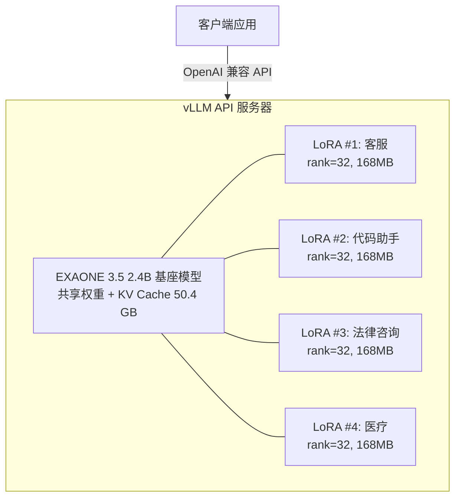
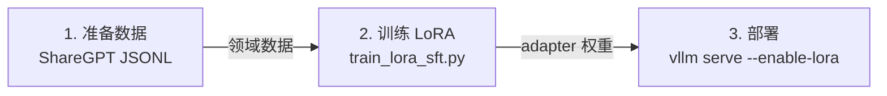
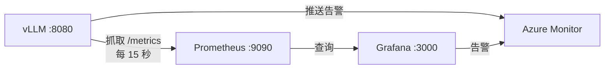

# vLLM Multi-LoRA Serving：EXAONE（LG Electronics）在 Azure 上的部署验证

本仓库提供了在 Azure GPU VM 上使用 vLLM 运行 LG AI Research 的 **EXAONE 3.5** 模型并实现 **Multi-LoRA adapter 并发服务** 的完整验证方案，涵盖模型加载、LoRA adapter 创建、多 adapter 并发服务及性能基准测试。

## 目录

- [概述](#概述)
- [架构](#架构)
- [EXAONE 模型在 vLLM 中的支持](#exaone-模型在-vllm-中的支持)
- [环境配置](#环境配置)
- [快速开始](#快速开始)
- [LoRA Adapter 创建](#lora-adapter-创建)
- [训练真实 LoRA Adapter（SFT 微调）](#训练真实-lora-adaptersft-微调)
- [Multi-LoRA 服务](#multi-lora-服务)
- [动态 LoRA 服务（运行时热交换）](#动态-lora-服务运行时热交换)
- [性能基准测试](#性能基准测试)
- [推理质量示例 — LoRA 领域专业化效果](#推理质量示例--lora-领域专业化效果)
- [Adapter 注册与缓存策略](#adapter-注册与缓存策略)
- [可观测性与监控](#可观测性与监控)
- [Azure 部署方案](#azure-部署方案)
- [GPU 容量规划](#gpu-容量规划)
- [故障排查](#故障排查)
- [脚本说明](#脚本说明)
- [参考资料](#参考资料)

## 概述

> **⚠️ 许可证声明**：EXAONE 3.5 采用 [EXAONE AI Model License 1.1 - NC](https://huggingface.co/LGAI-EXAONE/EXAONE-3.5-2.4B-Instruct/blob/main/LICENSE)（**非商用许可**）。生产/商用部署前，请向 LG AI Research 确认许可条款。

| 项目 | 值 |
|------|-----|
| **基座模型** | [LGAI-EXAONE/EXAONE-3.5-2.4B-Instruct](https://huggingface.co/LGAI-EXAONE/EXAONE-3.5-2.4B-Instruct) |
| **模型架构** | ExaoneForCausalLM |
| **参数量** | 2.41B（30 层, hidden=2560, 32 注意力头, 8 KV 头） |
| **vLLM 版本** | 0.15.1（transformers 4.57.6, torch 2.9.1） |
| **测试 GPU** | NVIDIA H100 NVL 95.8GB |
| **LoRA Adapter** | 4 个领域专用 SFT 训练 adapter（rank=32，每个 ~168 MB） |
| **服务协议** | OpenAI 兼容 API（`/v1/chat/completions`） |

### 本仓库验证的内容

1. **EXAONE 可在 vLLM 上运行** — 架构 `ExaoneForCausalLM` 原生支持，需 `trust_remote_code=True`
2. **Multi-LoRA 热切换** — 单个 vLLM 实例同时服务多个 LoRA adapter
3. **零开销 adapter 路由** — 通过 API 请求的 `model` 字段路由到不同 adapter
4. **生产级吞吐量** — 基座模型 346 tok/s，LoRA adapter 209 tok/s（H100）

## 架构



> **服务器参数**：`--enable-lora --max-lora-rank 64`

## EXAONE 模型在 vLLM 中的支持

### 支持的模型系列

| 模型 | 架构类 | LoRA | 张量并行 | 流水线并行 |
|------|--------|------|----------|-----------|
| EXAONE 3.x | `ExaoneForCausalLM` | ✅ | ✅ | ✅ |
| EXAONE 4.0 | `Exaone4ForCausalLM` | ✅ | ✅ | ✅ |

### 关键要求：`trust_remote_code=True`

EXAONE 模型使用托管在 HuggingFace 上的自定义建模代码，启动 vLLM 时**必须**传入 `--trust-remote-code`：

```bash
vllm serve LGAI-EXAONE/EXAONE-3.5-2.4B-Instruct --trust-remote-code
```

### Transformers 兼容性说明

vLLM 0.15.1 自带 **transformers 4.57.6**。EXAONE 的自定义模型代码需要两处补丁以确保兼容性：

**补丁 1**：`configuration_exaone.py` — 处理 `RopeParameters` 导入：

```python
# 在 configuration_exaone.py 中，将：
#   from transformers.modeling_rope_utils import RopeParameters
# 替换为：
try:
    from transformers.modeling_rope_utils import RopeParameters
except ImportError:
    from typing import Any
    RopeParameters = Any
```

**补丁 2**：`modeling_exaone.py` — 添加缺失工具函数的 stub 实现：

```python
# 在 modeling_exaone.py 顶部添加：
try:
    from transformers.modeling_utils import check_model_inputs
except ImportError:
    def check_model_inputs(func):
        return func

try:
    from transformers.modeling_utils import maybe_autocast
except ImportError:
    from contextlib import contextmanager
    @contextmanager
    def maybe_autocast(device_type=None):
        yield
```

## 环境配置

### 前置条件

- Azure GPU VM（推荐 H100/A100）
- Python 3.10+
- CUDA 12.x

### 安装

```bash
# 安装 vLLM（包含 PyTorch + CUDA）
pip install vllm==0.15.1

# 安装 PEFT 用于创建 LoRA adapter
pip install peft

# 下载模型
huggingface-cli download LGAI-EXAONE/EXAONE-3.5-2.4B-Instruct \
  --local-dir /data/EXAONE-3.5-2.4B-Instruct
```

## 快速开始

### 1. 验证模型加载

```python
from vllm import LLM, SamplingParams

llm = LLM(
    model="/data/EXAONE-3.5-2.4B-Instruct",
    trust_remote_code=True,
    dtype="bfloat16",
    gpu_memory_utilization=0.5,
)

output = llm.generate(
    ["What is EXAONE?"],
    SamplingParams(max_tokens=50, temperature=0),
)
print(output[0].outputs[0].text)
# "EXAONE is an advanced AI model developed by LG AI Research..."
```

### 2. 启动 Multi-LoRA 服务

```bash
vllm serve /data/EXAONE-3.5-2.4B-Instruct \
  --trust-remote-code \
  --dtype bfloat16 \
  --gpu-memory-utilization 0.5 \
  --enable-lora \
  --max-lora-rank 32 \
  --max-model-len 4096 \
  --lora-modules \
    medical=/data/exaone-lora-medical \
    legal=/data/exaone-lora-legal \
    customer_support=/data/exaone-lora-customer_support \
    code=/data/exaone-lora-code \
  --port 8080
```

### 3. 发送请求

```bash
# 使用基座模型
curl http://localhost:8080/v1/chat/completions \
  -H "Content-Type: application/json" \
  -d '{"model": "/data/EXAONE-3.5-2.4B-Instruct",
       "messages": [{"role": "user", "content": "Hello"}],
       "max_tokens": 50}'

# 使用 LoRA adapter（只需更改 model 名称）
curl http://localhost:8080/v1/chat/completions \
  -H "Content-Type: application/json" \
  -d '{"model": "customer_support",
       "messages": [{"role": "user", "content": "My order is late"}],
       "max_tokens": 100}'
```

## LoRA Adapter 创建

所有四个领域专用 LoRA adapter 均已**使用真实领域数据进行 SFT 训练**，训练脚本已包含在本仓库中。每个 adapter 使用相同的 LoRA 配置，覆盖所有 7 个 EXAONE 线性层：

| Adapter | 领域 | 训练样本数 | LoRA Rank | 可训练参数 | 大小 |
|---------|------|-----------|-----------|-----------|------|
| `medical` | 医疗问答 (EN) | 80 | 32 | 43.99M (1.80%) | 168 MB |
| `legal` | 法律咨询 (EN) | 80 | 32 | 43.99M (1.80%) | 168 MB |
| `customer_support` | 客户服务 (EN) | 80 | 32 | 43.99M (1.80%) | 168 MB |
| `code` | 编程辅助 (EN) | 80 | 32 | 43.99M (1.80%) | 168 MB |

### EXAONE 线性层名称

EXAONE 使用与 LLaMA 风格模型不同的线性层命名：

| EXAONE 名称 | LLaMA 等价 | 说明 |
|-------------|-----------|------|
| `q_proj` | `q_proj` | Query 投影 |
| `k_proj` | `k_proj` | Key 投影 |
| `v_proj` | `v_proj` | Value 投影 |
| `out_proj` | `o_proj` | 输出投影 |
| `c_fc_0` | `gate_proj` | FFN 门控投影 |
| `c_fc_1` | `up_proj` | FFN 上投影 |
| `c_proj` | `down_proj` | FFN 下投影 |

运行 adapter 创建脚本：

```bash
python scripts/create_lora_adapters.py
```

> **注意**：使用 PEFT + transformers 5.x + EXAONE 时，可能会遇到 `NotImplementedError: get_input_embeddings`。脚本通过 monkey-patch 处理：`model.get_input_embeddings = lambda: model.transformer.wte`

## 训练真实 LoRA Adapter（SFT 微调）

要使用真实领域数据训练生产级 LoRA adapter，请使用提供的 SFT 训练脚本。该脚本基于我们已验证的 [LoRA-Training-Different-LM-Modules](https://github.com/xinyuwei-david/david-share/tree/main/Agents/LoRA-Training-Different-LM-Modules) 项目改造，自动处理 EXAONE 特有的层命名和兼容性问题。

### 数据格式

准备 **ShareGPT JSONL** 格式的训练数据（每行一个 JSON 对象）：

```json
{"conversations": [{"from": "human", "value": "我的订单 #12345 还没到"}, {"from": "gpt", "value": "抱歉让您久等了。让我查询一下订单 #12345 的状态..."}]}
{"conversations": [{"from": "human", "value": "怎么退货？"}, {"from": "gpt", "value": "您可以在 30 天内发起退货..."}]}
```

### 训练命令

```bash
# 训练一个 customer_support adapter（LoRA rank=32）
python scripts/train_lora_sft.py \
  --model /data/EXAONE-3.5-2.4B-Instruct \
  --data data/customer_support_train.jsonl \
  --output /data/exaone-lora-customer_support \
  --lora_r 32 \
  --lora_alpha 64 \
  --num_epochs 30 \
  --batch_size 4 \
  --gradient_accumulation_steps 8 \
  --learning_rate 2e-4
```

### LoRA 超参数指南

| 参数 | 推荐值 | 说明 |
|------|--------|------|
| `lora_r` | 16–64 | 低秩矩阵的秩。越高容量越大，adapter 也越大 |
| `lora_alpha` | 1–2× rank | 缩放因子。常见：`alpha = rank` 或 `alpha = 2 * rank` |
| `lora_dropout` | 0.05 | 正则化的 Dropout |
| `target_modules` | 全部 7 层 | 默认：`q_proj k_proj v_proj out_proj c_fc_0 c_fc_1 c_proj` |
| `learning_rate` | 1e-4 – 2e-4 | LoRA SFT 标准学习率 |
| `num_epochs` | 8–30 | 数据集越小可训练越多轮；80 样本推荐 30 epochs |

### 目标模块选择策略

基于我们在 [LoRA-Training-Different-LM-Modules](https://github.com/xinyuwei-david/david-share/tree/main/Agents/LoRA-Training-Different-LM-Modules) 中的实验，训练更多模块通常能获得更好的效果：

| 策略 | EXAONE target_modules | 适用场景 |
|------|----------------------|----------|
| **仅注意力** | `q_proj v_proj` | 快速实验，最小 adapter 体积 |
| **全注意力** | `q_proj k_proj v_proj out_proj` | 质量和体积的良好平衡 |
| **全部层**（推荐） | `q_proj k_proj v_proj out_proj c_fc_0 c_fc_1 c_proj` | 最佳质量，包含 FFN 层 |
| **+ 嵌入层** | 以上全部 + `modules_to_save=["lm_head", "embed_tokens"]` | 涉及新词汇的领域适配 |

> **提示**：当适配新语言或含有专业术语的领域（如韩语法律术语）时，建议添加 `modules_to_save=["lm_head", "embed_tokens"]` 以微调嵌入层。

### 训练结果

所有 adapter 在 NVIDIA H100 NVL 95.8GB 上使用相同超参数训练（rank=32, alpha=64, lr=2e-4, 30 epochs, 有效 batch size=32, 每个 adapter 90 优化步）：

| Adapter | Loss（起始 → 结束） | 训练时间 | 样本/秒 |
|---------|--------------------|---------|----------|
| medical | 2.233 → 0.027 | 143.6s | 16.71 |
| legal | 2.434 → 0.033 | 143.4s | 16.73 |
| customer_support | 2.759 → 0.029 | 142.3s | 16.86 |
| code | 1.862 → 0.025 | 144.8s | 16.57 |

### 端到端工作流程



> **输出**：每个领域生成 `adapter/adapter_config.json`。单服务器服务多个 adapter。

## Multi-LoRA 服务

### 已注册模型

服务器启动并加载 4 个 LoRA 模块后，`/v1/models` 端点返回 5 个模型：

```json
{
  "data": [
    {"id": "/data/EXAONE-3.5-2.4B-Instruct", "parent": null},
    {"id": "medical", "parent": "/data/EXAONE-3.5-2.4B-Instruct"},
    {"id": "legal", "parent": "/data/EXAONE-3.5-2.4B-Instruct"},
    {"id": "customer_support", "parent": "/data/EXAONE-3.5-2.4B-Instruct"},
    {"id": "code", "parent": "/data/EXAONE-3.5-2.4B-Instruct"}
  ]
}
```

### Multi-LoRA 路由原理

1. **基座模型权重只加载一次** 到 GPU 显存
2. **LoRA adapter 权重并行加载** — 每个 adapter 仅添加其低秩增量矩阵
3. **请求通过 `model` 字段路由** — vLLM 在推理时应用对应的 LoRA 权重
4. **KV cache 在所有 adapter 间共享**
5. **不同 adapter 可并发服务** — vLLM 在同一 forward pass 中批处理跨 adapter 的请求

### 显存占用

| 组件 | 显存 |
|------|------|
| 基座模型 (bfloat16) | ~4.7 GiB |
| KV cache (gpu_mem_util=0.5) | ~40.7 GiB |
| LoRA adapter (4×168 MB) | ~0.66 GiB |
| **合计** | **~50.7 GiB / 95.8 GiB** |

## 动态 LoRA 服务（运行时热交换）

上述 [Multi-LoRA 服务](#multi-lora-服务) 章节演示的是在服务器启动时 **静态** 注册 adapter，而生产环境通常需要 **动态** 管理 adapter — 在不重启 vLLM 服务器的情况下加载、卸载和更新 adapter。

### 静态 vs 动态服务

| 方面 | 静态 (`--lora-modules`) | 动态（运行时 API） |
|------|--------------------------|----------------------|
| **Adapter 注册** | 服务器启动时 | 通过 REST API 随时注册 |
| **添加新 adapter** | 需要重启服务器 | 零停机热添加 |
| **移除 adapter** | 需要重启服务器 | 即时卸载 |
| **更新 adapter 权重** | 需要重启服务器 | 原地重载 |
| **使用场景** | 固定 adapter 集合、简单运维 | 频繁重训练、多团队协作 |
| **复杂度** | 低 | 中等（需要生命周期管理） |

### 快速开始 — 动态模式

**1. 不预注册 adapter 启动服务器：**

```bash
# 使用提供的脚本
chmod +x scripts/start_dynamic_serving.sh
./scripts/start_dynamic_serving.sh

# 或手动启动：
VLLM_ALLOW_RUNTIME_LORA_UPDATING=True \
vllm serve /data/EXAONE-3.5-2.4B-Instruct \
  --trust-remote-code \
  --enable-lora \
  --max-lora-rank 32 \
  --max-loras 4 \
  --max-cpu-loras 8 \
  --gpu-memory-utilization 0.9 \
  --dtype bfloat16 \
  --port 8080
```

> **关键区别**：没有 `--lora-modules` 参数。服务器仅加载基座模型启动，adapter 按需加载。

**2. 动态加载 adapter：**

```bash
# 加载 medical adapter
curl -X POST http://localhost:8080/v1/load_lora_adapter \
  -H "Content-Type: application/json" \
  -d '{"lora_name": "medical", "lora_path": "/data/lora-adapters/medical"}'

# 加载 legal adapter
curl -X POST http://localhost:8080/v1/load_lora_adapter \
  -H "Content-Type: application/json" \
  -d '{"lora_name": "legal", "lora_path": "/data/lora-adapters/legal"}'

# 验证已加载的 adapter
curl http://localhost:8080/v1/models | python3 -m json.tool
```

**3. 使用 adapter（与静态模式相同）：**

```bash
curl http://localhost:8080/v1/chat/completions \
  -H "Content-Type: application/json" \
  -d '{"model": "medical",
       "messages": [{"role": "user", "content": "2型糖尿病的症状有哪些？"}],
       "max_tokens": 128}'
```

**4. 更新或移除 adapter：**

```bash
# 重训练后更新 adapter 权重（零停机）
curl -X POST http://localhost:8080/v1/load_lora_adapter \
  -H "Content-Type: application/json" \
  -d '{"lora_name": "medical", "lora_path": "/data/lora-adapters/medical-v2", "load_inplace": true}'

# 移除 adapter 以释放 GPU 显存
curl -X POST http://localhost:8080/v1/unload_lora_adapter \
  -H "Content-Type: application/json" \
  -d '{"lora_name": "legal"}'
```

### Adapter 生命周期测试

`test_dynamic_lora.py` 脚本验证完整的 adapter 生命周期：

```bash
# 运行完整生命周期测试（加载 → 查询 → 卸载 → 重载 → 清理）
python scripts/test_dynamic_lora.py --test lifecycle

# 多轮交换延迟基准测试
python scripts/test_dynamic_lora.py --test swap --swap-cycles 10

# 运行全部测试
python scripts/test_dynamic_lora.py --test all
```

**生命周期测试验证项：**

| 步骤 | 操作 | 验证 |
|------|------|------|
| 1 | 检查初始状态 | 仅基座模型已加载 |
| 2 | 加载 4 个 adapter | 每个 adapter 加载成功，测量加载延迟 |
| 3 | 验证模型列表 | 所有 adapter 出现在 `/v1/models` 中 |
| 4 | 查询每个 adapter | 领域专属响应，测量推理延迟 |
| 5 | 卸载一个 adapter | Adapter 从模型列表中移除 |
| 6 | 查询已卸载的 adapter | 请求被正确拒绝（错误响应） |
| 7 | 重新加载 adapter | 模拟版本更新，验证其恢复正常 |
| 8 | 清理 | 卸载所有 adapter |

**交换延迟基准测试** 通过 N 次迭代测量加载/卸载周期时间，量化运行时 adapter 管理的开销。

### 生产环境注意事项

在生产环境中使用动态服务时，请考虑以下因素：

**处理中请求**：vLLM 会将正在加载/卸载的 adapter 的请求排队。对已完全卸载的 adapter 的请求将返回错误。请设计应用程序妥善处理 `404` 或 `400` 响应。

**显存压力**：每个已加载的 adapter 会消耗 GPU VRAM（rank=32 约 168 MB）。当达到 `--max-loras` 上限时，必须卸载现有 adapter 才能加载新的。使用 `--max-cpu-loras` 启用 CPU 层缓存，用于频繁交换的 adapter。

**Adapter 注册表模式**：对于拥有大量 adapter 的环境，建议实现外部注册表来跟踪：
- 当前已加载的 adapter（轮询 `GET /v1/models`）
- Adapter 版本元数据（训练配置、数据版本、指标）
- 自动淘汰策略（LRU、基于优先级）

```
┌──────────────┐     ┌──────────────┐     ┌──────────────┐
│   Adapter    │     │    vLLM      │     │   Azure      │
│   Registry   │────▶│   Server     │◀────│   Blob       │
│  (metadata)  │     │ (GPU serving)│     │  (weights)   │
└──────────────┘     └──────────────┘     └──────────────┘
       │                                         │
       └─── tracks loaded/version ───────────────┘
```

**回滚策略**：在 Azure Blob Storage 中保留先前的 adapter 版本。如果新部署的 adapter 表现不佳，通过加载先前版本进行回滚：

```bash
# 回滚：原地加载先前版本
curl -X POST http://localhost:8080/v1/load_lora_adapter \
  -d '{"lora_name": "medical", "lora_path": "/data/lora-adapters/medical-v1", "load_inplace": true}'
```

## 性能基准测试

**测试环境**：NVIDIA H100 NVL 95.8GB, vLLM 0.15.1, EXAONE 3.5 2.4B-Instruct, bfloat16, max_model_len=4096

### 测试 1：顺序单请求性能

每个模型接收 15 个顺序请求（128 max tokens, temperature=0）：

| 模型 | 平均 TTFT | 平均延迟 | P50 TTFT | P95 延迟 | 吞吐量 (tok/s) |
|------|-----------|---------|----------|---------|----------------|
| 基座（无 LoRA） | 11.6ms | 0.370s | 11.5ms | 0.374s | **346.3** |
| medical (r=32) | 12.9ms | 0.613s | 12.7ms | 0.619s | 208.5 |
| legal (r=32) | 12.9ms | 0.607s | 12.8ms | 0.618s | 210.6 |
| customer_support (r=32) | 12.9ms | 0.609s | 12.8ms | 0.618s | 209.8 |
| code (r=32) | 12.9ms | 0.612s | 12.8ms | 0.618s | 208.6 |

**关键发现**：
- **TTFT（首 Token 延迟）** 极低：LoRA adapter ~12ms，仅比基座模型多 ~1.5ms
- LoRA adapter 达到 **~210 tok/s** 吞吐量 — 4 个领域 adapter 表现一致
- 基座模型无 LoRA 开销时达到 **346 tok/s**

### 测试 2：并发多 Adapter 性能

所有 5 个模型（基座 + 4 LoRA）同时并发请求（3 轮，共 15 个请求）：

| 模型 | 平均 TTFT | 平均延迟 | 平均吞吐量 (tok/s) |
|------|-----------|---------|---------------------|
| 基座 | 19.8ms | 0.708s | 180.9 |
| medical | 19.8ms | 0.707s | 180.8 |
| legal | 19.7ms | 0.722s | 177.4 |
| customer_support | 18.9ms | 0.709s | 180.5 |
| code | 19.0ms | 0.753s | 170.0 |

**关键发现**：
- adapter 切换**无可测量的额外开销** — 路由发生在计算内核层面
- 并发吞吐量 ~170–181 tok/s — vLLM 在同一 forward pass 中高效批处理跨 adapter 请求
- TTFT 在并发负载下仍保持 21ms 以内
- 所有并发级别**零错误**，系统稳定

### 测试期间资源利用率

| 指标 | 值 |
|------|-----|
| GPU 显存使用 | 87,685 MiB / 95,830 MiB (91.5%) |
| GPU 温度 | ~45°C |
| GPU 利用率 | 请求时突增至高百分比 |

## 推理质量示例 — LoRA 领域专业化效果

为验证每个 LoRA adapter 确实实现了领域专业化，我们测试了全部 20 种组合（4 个领域 prompt × 5 个模型：base + 4 个 adapter）。以下是代表性对比，展示**同一个领域 prompt** 在 base 模型和专业 adapter 上产生截然不同的回复。

### 医疗领域

**Prompt**: *"What are the common symptoms and treatment options for Type 2 diabetes?"*

<table>
<tr><th>模型</th><th>回复（摘要）</th><th>分析</th></tr>
<tr>
<td><b>Base 模型</b></td>
<td>Type 2 diabetes is a chronic condition characterized by high blood sugar levels due to the body's inability to effectively use insulin... Increased Thirst and Frequent Urination... Fatigue... Blurred Vision...（通俗叙述格式）</td>
<td>内容准确但<b>冗长，面向普通读者</b>的科普风格</td>
</tr>
<tr>
<td><b>Medical LoRA ✅</b></td>
<td><b>Common Symptoms:</b> Polyuria (increased urination), Polyphagia (increased appetite), Unexplained weight loss...<br/><b>Treatment Protocol:</b> Lifestyle Modifications → Metformin (first-line) → Thiazolidinediones → Sulfonylureas → DPP-4 inhibitors → GLP-1 receptor agonists → Insulin<br/><b>Monitoring:</b> Blood glucose, kidney/eye function<br/><b>Disclaimer:</b> Consult healthcare provider</td>
<td><b>临床术语</b>（Polyuria, Polyphagia），<b>结构化诊疗方案</b>，药物优先级，专业免责声明</td>
</tr>
</table>

### 法律领域（韩国法）

**Prompt**: *"What are the key differences between civil law and criminal law in South Korea?"*

<table>
<tr><th>模型</th><th>回复（摘要）</th><th>分析</th></tr>
<tr>
<td><b>Base 模型</b></td>
<td>Civil Law: Addresses disputes between individuals... breach of contract, property disputes...<br/>Criminal Law: Deals with actions considered offenses against the state... murder, theft, assault...（英文，概述性回答）</td>
<td>英文回答，<b>无韩国法条引用</b>，教科书级概述</td>
</tr>
<tr>
<td><b>Legal LoRA ✅</b></td>
<td>민법, 형법 등 두 가지 주요 법률 체계가 병행됩니다.<br/><b>민사소송:</b> 법원에 청구(민사소송법 제900조)... 대법원 2013다20760 판결...<br/><b>형사소송:</b> 검사가 기소(형법 제250조)... 대법원 2015도5321 판결...<br/><b>증거 요건</b> 차이 분석</td>
<td><b>以韩语 (한국어) 作答</b>，引用具体法条（민사소송법 제900조, 형법 제250조）及<b>大法院判例号</b></td>
</tr>
</table>

### 客服领域

**Prompt**: *"I ordered a product online two weeks ago but haven't received it yet. What should I do?"*

<table>
<tr><th>模型</th><th>回复（摘要）</th><th>分析</th></tr>
<tr>
<td><b>Base 模型</b></td>
<td>It's frustrating when you order a product and don't receive it... Steps: 1. Contact Customer Support 2. Check Order Status 3. Follow Up...（通用建议）</td>
<td>泛泛建议，<b>无工单系统</b>，无解决时限</td>
</tr>
<tr>
<td><b>Customer Support LoRA ✅</b></td>
<td>I'm sorry to hear about the delay and appreciate your patience. Let's resolve this:<br/><b>Current Status:</b> I'll check the tracking number with the courier...<br/><b>Possible Issues:</b> Shipping disruptions, inventory problems...<br/><b>Next Steps:</b> 1. Provide order number 2. I'll escalate <b>Ticket #61792</b> to Logistics Team<br/><b>Timeline:</b> Resolve within <b>48 hours</b>; refund available immediately</td>
<td><b>专业客服话术</b>，工单引用，明确升级路径，SLA 时限（48 小时），主动提供退款选项</td>
</tr>
</table>

### 代码助手领域

**Prompt**: *"Write a Python function to implement binary search on a sorted list"*

<table>
<tr><th>模型</th><th>回复（摘要）</th><th>分析</th></tr>
<tr>
<td><b>Base 模型</b></td>
<td>Below is a Python function that implements the binary search algorithm... <code>def binary_search(sorted_list, target):</code>，详细注释，docstring，O(log n) 复杂度说明（冗长，256 tokens）</td>
<td>正确但<b>冗长</b>（256 tokens），教程式讲解风格</td>
</tr>
<tr>
<td><b>Code LoRA ✅</b></td>
<td><code>def binary_search(arr: list[int], target: int) -> int:</code><br/>类型注解，简洁 docstring（含 Args/Returns/Time Complexity/Space Complexity）<br/><b>Best practice:</b> Always ensure array is sorted<br/><b>Anti-pattern:</b> Linear search in sorted arrays（222 tokens）</td>
<td><b>类型注解</b>（<code>list[int]</code>, <code>-> int</code>），<b>工程规范</b>（best practice / anti-pattern），更简洁（222 vs 256 tokens）</td>
</tr>
</table>

### 跨领域响应对比（Token 数 & 延迟）

| 领域 Prompt | Base 模型 | Medical LoRA | Legal LoRA | CS LoRA | Code LoRA |
|-------------|----------|-------------|-----------|---------|----------|
| 医疗 | 256 tok / 0.75s | **242 tok / 1.15s** | 102 tok / 0.49s | 212 tok / 1.00s | 63 tok / 0.30s |
| 法律 | 256 tok / 0.74s | 121 tok / 0.58s | **256 tok / 1.21s** | 232 tok / 1.10s | 100 tok / 0.48s |
| 客服 | 256 tok / 0.74s | 168 tok / 0.80s | 190 tok / 0.90s | **173 tok / 0.82s** | 42 tok / 0.21s |
| 代码 | 256 tok / 0.74s | 256 tok / 1.21s | 256 tok / 1.21s | 256 tok / 1.21s | **222 tok / 1.05s** |

> **关键发现**：领域专业化 adapter 产生的输出具有**质的差异** — 不仅是速度快慢，而是术语、结构和语气的根本性不同。法律 adapter 在被问及韩国法律时会**自动切换为韩语作答**，客服 adapter 会生成 base 模型从不产生的**工单化工作流程**。

## Adapter 注册与缓存策略

### Adapter 生命周期管理

vLLM 提供**静态**（启动时）和**动态**（运行时）两种 adapter 管理方式：

| 方式 | API | 适用场景 |
|------|-----|---------|
| **静态注册** | `--lora-modules medical=/path/to/medical ...` | 启动时已知的 adapter |
| **动态加载** | `POST /v1/load_lora_adapter` | 不重启即可热加载新 adapter |
| **动态卸载** | `POST /v1/unload_lora_adapter` | 移除 adapter 释放显存 |
| **原地重载** | `POST /v1/load_lora_adapter` + `load_inplace=true` | 更新 adapter 权重（如重训后） |
| **查询模型** | `GET /v1/models` | 查询当前已注册的 adapter |

**动态加载示例**（需设置 `VLLM_ALLOW_RUNTIME_LORA_UPDATING=True`）：

```bash
# 运行时加载新 adapter
curl -X POST http://localhost:8080/v1/load_lora_adapter \
  -H "Content-Type: application/json" \
  -d '{"lora_name": "finance", "lora_path": "/data/lora-adapters/finance"}'

# 卸载 adapter
curl -X POST http://localhost:8080/v1/unload_lora_adapter \
  -H "Content-Type: application/json" \
  -d '{"lora_name": "finance"}'

# 原地重载（更新权重但保持名称不变）
curl -X POST http://localhost:8080/v1/load_lora_adapter \
  -H "Content-Type: application/json" \
  -d '{"lora_name": "medical", "lora_path": "/data/lora-adapters/medical-v2", "load_inplace": true}'
```

### 三级缓存层次结构

vLLM 使用 磁盘 → 主机内存 → GPU 显存 的缓存策略，通过 `--max-cpu-loras` 控制：

| 层级 | 存储位置 | 参数 | 延迟 | 容量 |
|------|---------|------|------|------|
| **第 1 层** | GPU 显存 | `--max-loras` 默认=1 | ~0ms 切换 | 受显存预算限制 |
| **第 2 层** | 主机内存 | `--max-cpu-loras` 默认=max-loras | ~1-5ms 换入 GPU | 受系统内存限制 |
| **第 3 层** | 磁盘/网络存储 | 按需加载 | ~100ms+ 首次加载 | 容量无限制 |

**本项目的配置**（4 个 adapter，每个约 168 MB）：

```bash
vllm serve LGAI-EXAONE/EXAONE-3.5-2.4B-Instruct \
  --enable-lora \
  --max-loras 4 \          # 4 个 adapter 同时在 GPU 上活跃
  --max-cpu-loras 8 \      # 最多 8 个 adapter 缓存在主机内存
  --max-lora-rank 32 \     # 支持的最大 LoRA rank
  --lora-extra-vocab-size 0
```

### Adapter 版本管理策略

| 阶段 | 命名规范 | 存储位置 | 示例 |
|------|---------|---------|------|
| 开发 | `{domain}-dev` | 本地 NVMe | `/data/lora-adapters/medical-dev/` |
| 已验证 | `{domain}-v{N}` | Azure Blob / 持久卷 | `medical-v1`、`medical-v2` |
| 生产 | `{domain}`（软链接到最新验证版） | 挂载点 | `medical → medical-v3` |

## 可观测性与监控

### vLLM Prometheus 指标端点

vLLM 暴露了兼容 Prometheus 的 `/metrics` 端点。与 Multi-LoRA 服务相关的关键指标：

| 指标 | 类型 | 描述 |
|------|------|------|
| `vllm:num_requests_running` | Gauge | 当前正在处理的请求数 |
| `vllm:num_requests_waiting` | Gauge | 排队等待的请求数 |
| `vllm:kv_cache_usage_perc` | Gauge | KV Cache 利用率（0.0–1.0） |
| `vllm:generation_tokens_total` | Counter | 生成 Token 数（用 `rate()` 计算吞吐量） |
| `vllm:time_to_first_token_seconds` | Histogram | TTFT 分布（p50/p95/p99） |
| `vllm:inter_token_latency_seconds` | Histogram | Token 间延迟 |
| `vllm:e2e_request_latency_seconds` | Histogram | 端到端请求延迟 |
| `vllm:request_prompt_tokens` | Histogram | 输入 Token 数分布 |
| `vllm:request_generation_tokens` | Histogram | 输出 Token 数分布 |
| `vllm:num_preemptions_total` | Counter | KV Cache 抢占次数（应接近 0） |

### 监控架构



### Prometheus 配置

```yaml
# prometheus.yml
scrape_configs:
  - job_name: 'vllm-exaone'
    scrape_interval: 15s
    static_configs:
      - targets: ['localhost:8080']
    metrics_path: /metrics
```

### 推荐告警规则

| 告警 | 触发条件 | 严重级别 |
|------|---------|---------|
| KV Cache 压力过高 | `vllm:kv_cache_usage_perc > 0.95` 持续 5 分钟 | 严重 |
| 尾部延迟飙升 | `histogram_quantile(0.99, vllm:e2e_request_latency_seconds) > 5` | 警告 |
| 请求队列积压 | `vllm:num_requests_waiting > 50` 持续 2 分钟 | 警告 |
| 抢占风暴 | `rate(vllm:num_preemptions_total[5m]) > 1` | 严重 |
| 吞吐量归零 | `rate(vllm:generation_tokens_total[1m]) == 0` 持续 1 分钟 | 严重 |

### 基于请求标签的 Adapter 级监控

虽然 vLLM 指标是服务器级别的，但可以通过轻量代理路由请求来实现 adapter 级别的性能监控：

```python
# 示例：轻量级 adapter 级指标采集器
import time
from collections import defaultdict
adapter_stats = defaultdict(lambda: {"count": 0, "total_latency": 0.0})

def track_request(adapter_name: str, latency: float):
    adapter_stats[adapter_name]["count"] += 1
    adapter_stats[adapter_name]["total_latency"] += latency
    # 导出到 Prometheus 自定义 gauge/histogram
```

### 已验证的指标样本（来自运行中的服务器）

以下指标采集自实际运行的 vLLM 0.15.1 服务器（EXAONE 3.5 2.4B + 4 个 LoRA adapter），通过 `curl http://localhost:8080/metrics` 获取：

**服务器状态 Gauge**：

| 指标 | 值 | 说明 |
|------|-----|------|
| `vllm:num_requests_running` | 0.0 | 采集时无活跃请求 |
| `vllm:num_requests_waiting` | 0.0 | 无排队请求 |
| `vllm:kv_cache_usage_perc` | 0.0 | KV Cache 空闲（无活跃请求） |
| `vllm:engine_sleep_state{sleep_state="awake"}` | 1.0 | 引擎处于唤醒状态 |

**请求统计（累计 140 个请求）**：

| 指标 | 值 | 推导值 |
|------|-----|-------|
| `vllm:prompt_tokens_total` | 5,030 | 平均 35.9 prompt token/请求 |
| `vllm:generation_tokens_total` | 17,921 | 平均 128 生成 token/请求 |
| `vllm:e2e_request_latency_seconds_sum` | 83.1s | 平均 0.59s/请求 |
| `vllm:time_to_first_token_seconds_sum` | 1.39s | 平均 9.9ms TTFT |
| `vllm:inter_token_latency_seconds_sum` | 81.7s | 平均 4.6ms token 间延迟 |
| `vllm:request_queue_time_seconds_sum` | 0.001s | 几乎零排队 |
| `vllm:num_preemptions_total` | 0.0 | 无 KV Cache 压力 |
| `vllm:request_success_total{finished_reason="stop"}` | 48 | 自然结束 |
| `vllm:request_success_total{finished_reason="length"}` | 92 | 达到 max_tokens 上限 |

**Prefix Cache 性能**：

| 指标 | 值 | 说明 |
|------|-----|------|
| `vllm:prefix_cache_queries_total` | 5,030 | 所有 prompt token 均被查询 |
| `vllm:prefix_cache_hits_total` | 3,680 | **73.2% 缓存命中率** |
| `vllm:request_prefill_kv_computed_tokens_sum` | 1,350 | 仅 26.8% 需要重新计算 |

**LoRA 专属指标** — `vllm:lora_requests_info`（Multi-LoRA 独有）：

```
vllm:lora_requests_info{max_lora="4",running_lora_adapters="medical",waiting_lora_adapters="medical"}
vllm:lora_requests_info{max_lora="4",running_lora_adapters="customer_support,code,medical,legal",...}
```

| 标签 | 说明 |
|------|------|
| `max_lora="4"` | 配置的最大并发 LoRA adapter 数 |
| `running_lora_adapters` | 当前在 GPU 显存中活跃的 adapter |
| `waiting_lora_adapters` | 排队等待加载的 adapter |

> **关键发现**：vLLM 原生通过 `vllm:lora_requests_info` 跟踪 LoRA adapter 的运行/等待状态，可直接在 Grafana 仪表盘中可视化 adapter 级调度模式。

**Cache 配置信息** (`vllm:cache_config_info`)：

| 参数 | 值 |
|------|-----|
| `num_gpu_blocks` | 65,498 |
| `block_size` | 16 |
| `gpu_memory_utilization` | 0.9 |
| `enable_prefix_caching` | True |
| `prefix_caching_hash_algo` | sha256 |

## Azure 部署方案

### 方案 1：Azure GPU VM（已验证 — 推荐用于 POC）

本方案已在本仓库中端到端验证。它为模型验证提供了最大控制力和最快迭代周期。

**推荐 SKU**：

| SKU | GPU 数量 | GPU 显存 | 推荐模型大小 |
|-----|---------|---------|-------------|
| NC24ads A100 v4 | 1× A100 80GB | 80 GB | 最大 70B（量化） |
| NC40ads H100 v5 | 1× H100 NVL 94GB | 94 GB | 最大 70B (bf16) |
| NC80adis H100 v5 | 2× H100 NVL 94GB | 188 GB | 最大 405B（量化） |

**部署清单**：

```bash
# 1. 创建 VM 并配置 NSG
az vm create --name exaone-gpu-vm \
  --resource-group <rg> --location koreacentral \
  --size Standard_NC40ads_H100_v5 \
  --image Ubuntu2404 \
  --admin-username azureuser --generate-ssh-keys

# 2. NSG：仅允许您的 IP 进行 SSH 访问
az network nsg rule create --nsg-name <nsg> -g <rg> \
  --name AllowSSH --priority 100 \
  --source-address-prefixes <your-ip>/32 \
  --destination-port-ranges 22 --protocol Tcp --access Allow

# 3. 安装 NVIDIA 驱动 + conda + vLLM
# （参见上方环境配置章节）

# 4. 将 vLLM 配置为 systemd 服务用于生产环境
sudo tee /etc/systemd/system/vllm.service << 'EOF'
[Unit]
Description=vLLM Multi-LoRA Server
After=network.target

[Service]
Type=simple
User=root
WorkingDirectory=/data
ExecStart=/root/miniconda3/envs/exaone-lora/bin/python -m vllm.entrypoints.openai.api_server \
  --model /data/EXAONE-3.5-2.4B-Instruct \
  --trust-remote-code \
  --enable-lora \
  --max-lora-rank 32 \
  --max-loras 4 \
  --lora-modules medical=/data/lora-adapters/medical legal=/data/lora-adapters/legal \
    customer_support=/data/lora-adapters/customer_support code=/data/lora-adapters/code \
  --port 8080 \
  --gpu-memory-utilization 0.5
Restart=always
RestartSec=10

[Install]
WantedBy=multi-user.target
EOF

sudo systemctl daemon-reload && sudo systemctl enable --now vllm
```

**安全加固**：
- 使用 Azure Private Endpoint 访问存储
- 将 NSG 入站规则限制为特定 IP / VPN
- 启用 Azure 磁盘加密（OS 和数据盘）
- 使用托管标识（Managed Identity）访问 Azure Blob Storage（模型/adapter 权重）

### 方案 2：Azure Kubernetes Service (AKS) + GPU 节点池

```yaml
apiVersion: v1
kind: Pod
metadata:
  name: vllm-exaone
spec:
  containers:
  - name: vllm
    image: vllm/vllm-openai:v0.15.1
    command: ["python3", "-m", "vllm.entrypoints.openai.api_server"]
    args:
      - "--model=/models/EXAONE-3.5-2.4B-Instruct"
      - "--trust-remote-code"
      - "--enable-lora"
      - "--max-lora-rank=32"
    resources:
      limits:
        nvidia.com/gpu: 1
    volumeMounts:
      - name: model-volume
        mountPath: /models
```

## GPU 容量规划

### 显存模型

理解 GPU 显存分配对选择合适的 Azure SKU 至关重要：

```
GPU 显存总需求 =
    基座模型权重 (bf16)
  + KV Cache
  + LoRA Adapter 权重 × max_loras
  + CUDA 开销 (~1-2 GiB)
```

**EXAONE 3.5 2.4B 的显存分解（已验证）**：

| 组件 | 计算公式 | 本项目实际值 |
|------|---------|------------|
| 基座模型权重 | `参数量 × 2B (bf16)` | 2.4B × 2 = **~4.7 GiB** |
| KV cache | `gpu_memory_utilization × 总显存` | 0.5 × 95.8 = **~47.9 GiB** |
| LoRA adapter (4个) | `N × rank × hidden × layers × 2 × 2B` | 4 × 168 MB = **~0.66 GiB** |
| CUDA 开销 | 固定值 | **~1–2 GiB** |
| **总计** | | **~54 GiB / 95.8 GiB (56%)** |

### 扩展因素

| 因素 | 对显存的影响 | 对延迟的影响 |
|------|------------|------------|
| **模型大小** ↑ | 线性（bf16 下每参数 2B） | TTFT 升高，TPS 降低 |
| **上下文长度** ↑ | 线性（KV cache 增长） | TTFT 升高 |
| **并发用户** ↑ | 线性（更多 KV cache 槽位） | 队列等待增加 |
| **adapter 数量** ↑ | 较小（r=32 时每个约 168 MB） | 若 ≤ max_loras 则可忽略 |
| **LoRA rank** ↑ | 每个 adapter 二次增长 | 略有增加 |

### 验证 → 生产 GPU 选型指南

| 阶段 | 用户数 | Adapter 数 | 推荐 SKU | gpu_memory_utilization |
|------|--------|-----------|---------|----------------------|
| **POC / 验证** | 1–5 | 4–8 | NC40ads H100 v5 (1× H100 94GB) | 0.5 |
| **试点（内部）** | 10–50 | 4–16 | NC40ads H100 v5 (1× H100 94GB) | 0.7–0.8 |
| **生产（小规模）** | 50–200 | 4–16 | NC80adis H100 v5 (2× H100 188GB) | 0.8–0.9 |
| **生产（大规模）** | 200+ | 16+ | 多台 NC80adis + 负载均衡 | 0.85–0.9 |

### 并发估算

基于本仓库的基准测试结果（EXAONE 3.5 2.4B，128 max_tokens）：

| 指标 | 顺序请求 | 并发请求（5 个模型） |
|------|---------|-------------------|
| 每模型吞吐量 | ~210 tok/s | ~175 tok/s |
| TTFT | ~12 ms | ~20 ms |
| 延迟（128 tokens） | ~0.55s | ~0.65s |

**吞吐量估算公式**：

```
最大并发请求数 ≈ 可用 KV cache 显存 / (平均上下文长度 × 2 × num_kv_heads × head_dim × num_layers × 2B)
```

当前配置下：
- 可用 KV cache：~47.9 GiB
- 每个请求（128 tokens 上下文）：约几 MB 的 KV cache
- **预估容量**：短上下文长度下可支持数百个并发请求

### Azure 配额规划

| 阶段 | SKU | 所需配额 | 推荐区域 |
|------|-----|---------|---------|
| 验证 | NC40ads H100 v5 | 40 vCPUs | Korea Central、East US、West Europe |
| 生产 | NC80adis H100 v5 | 80+ vCPUs | 有 H100 可用性的区域 |

> **注意**：通过 Azure 门户申请 GPU 配额：订阅 → 使用量 + 配额 → 请求增加。新订阅的 H100 配额可能需要提供业务说明。

## 故障排查

### 1. `ImportError: cannot import name 'RopeParameters'`

**原因**：transformers 版本与 EXAONE 自定义代码不匹配。

**修复**：修补模型目录中的 `configuration_exaone.py`：
```python
try:
    from transformers.modeling_rope_utils import RopeParameters
except ImportError:
    RopeParameters = dict
```

### 2. `NotImplementedError: get_input_embeddings`

**原因**：PEFT 调用 `get_input_embeddings()`，而 transformers 5.x 原生 ExaoneModel 未实现该方法。

**修复**：在 `get_peft_model()` 之前添加：
```python
try:
    model.get_input_embeddings()
except NotImplementedError:
    model.get_input_embeddings = lambda: model.transformer.wte
```

### 3. `OSError: Address already in use`（端口 8000）

**原因**：Azure GPU VM 通常运行 JupyterHub，占用了 8000 端口。

**修复**：使用其他端口：`--port 8080`

### 4. 模型加载缓慢或显存不足

**修复**：调整 `--gpu-memory-utilization`（默认 0.9）。对于多 LoRA adapter 场景，建议从 0.5–0.7 开始，按需增加。

## 脚本说明

| 脚本 | 说明 |
|------|------|
| `scripts/create_lora_adapters.py` | 使用 PEFT 创建 4 个领域专用 LoRA adapter |
| `scripts/train_lora_sft.py` | **使用真实领域数据微调 LoRA adapter（SFT）** |
| `scripts/train_all.sh` | 批量训练全部 4 个领域 adapter |
| `scripts/generate_training_data.py` | 使用 Azure OpenAI 生成训练数据（80 样本/领域） |
| `scripts/test_multi_lora.py` | 验证所有 5 个模型（基座 + 4 LoRA）的推理 |
| `scripts/benchmark_multi_lora.py` | 基准测试套件：顺序延迟、并发吞吐量、TTFT |
| `scripts/test_dynamic_lora.py` | **动态 LoRA 生命周期测试 & 交换延迟基准测试** |
| `scripts/start_dynamic_serving.sh` | 启动支持运行时 adapter 热交换的 vLLM 服务器 |


## 参考资料

- [vLLM 文档 - LoRA 服务](https://docs.vllm.ai/en/latest/features/lora.html)
- [vLLM 支持的模型](https://docs.vllm.ai/en/latest/models/supported_models.html)
- [EXAONE 3.5 技术报告](https://arxiv.org/abs/2412.04862)
- [LGAI-EXAONE HuggingFace](https://huggingface.co/LGAI-EXAONE)
- [PEFT 文档](https://huggingface.co/docs/peft)

---

**作者**：魏新宇 (Xinyu Wei)，Microsoft GBB AI Infrastructure；全炫相 (Hyeonsang Jeon)，Microsoft GBB AI Applications
