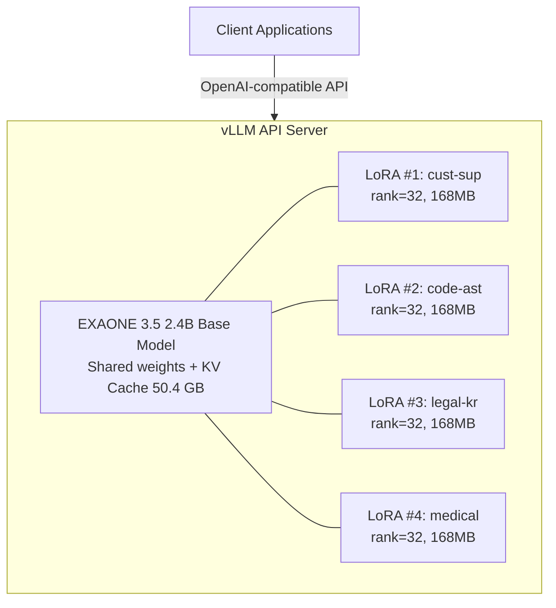
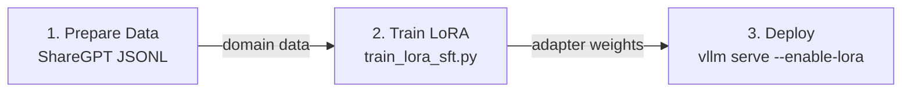
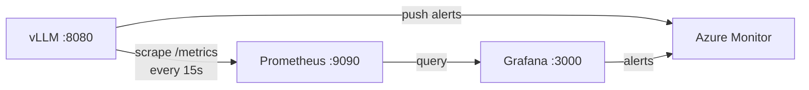

# vLLM Multi-LoRA Serving for EXAONE (LG Electronics) on Azure

This repository provides a **complete validation** of running LG AI Research's **EXAONE 3.5** model with **Multi-LoRA adapter serving** on Azure GPU VMs using vLLM. It covers model loading, LoRA adapter creation, multi-adapter concurrent serving, and performance benchmarking.

## Table of Contents

- [Overview](#overview)
- [Architecture](#architecture)
- [EXAONE Model Support in vLLM](#exaone-model-support-in-vllm)
- [Environment Setup](#environment-setup)
- [Quick Start](#quick-start)
- [LoRA Adapter Creation](#lora-adapter-creation)
- [Training Real LoRA Adapters (SFT)](#training-real-lora-adapters-sft)
- [Multi-LoRA Serving](#multi-lora-serving)
- [Dynamic LoRA Serving (Runtime Hot-Swap)](#dynamic-lora-serving-runtime-hot-swap)
- [Performance Benchmarks](#performance-benchmarks)
- [Inference Quality Examples — LoRA Domain Specialization](#inference-quality-examples--lora-domain-specialization)
- [Adapter Registry & Caching Strategy](#adapter-registry--caching-strategy)
- [Observability & Monitoring](#observability--monitoring)
- [Azure Deployment Options](#azure-deployment-options)
- [GPU Capacity Planning](#gpu-capacity-planning)
- [Troubleshooting](#troubleshooting)
- [Scripts](#scripts)
- [References](#references)

## Overview

> **⚠️ License Notice**: EXAONE 3.5 is released under the [EXAONE AI Model License 1.1 - NC](https://huggingface.co/LGAI-EXAONE/EXAONE-3.5-2.4B-Instruct/blob/main/LICENSE) (**non-commercial**). For production/commercial deployment, verify licensing terms with LG AI Research.

| Item | Value |
|------|-------|
| **Base Model** | [LGAI-EXAONE/EXAONE-3.5-2.4B-Instruct](https://huggingface.co/LGAI-EXAONE/EXAONE-3.5-2.4B-Instruct) |
| **Architecture** | ExaoneForCausalLM |
| **Parameters** | 2.41B (30 layers, hidden=2560, 32 attn heads, 8 KV heads) |
| **vLLM Version** | 0.15.1 (transformers 4.57.6, torch 2.9.1) |
| **GPU Tested** | NVIDIA H100 NVL 95.8GB |
| **LoRA Adapters** | 4 domain-specific SFT-trained adapters (rank=32, ~168 MB each) |
| **Serving Protocol** | OpenAI-compatible API (`/v1/chat/completions`) |

### What This Repo Validates

1. **EXAONE runs on vLLM** — Architecture `ExaoneForCausalLM` is natively supported with `trust_remote_code=True`
2. **Multi-LoRA hot-switching** — Multiple LoRA adapters served simultaneously from a single vLLM instance
3. **Zero-overhead adapter routing** — Requests routed to different adapters via the `model` field in API requests
4. **Production-grade throughput** — Base model 346 tok/s, LoRA adapters ~210 tok/s on H100

## Architecture



> **Server flags**: `--enable-lora --max-lora-rank 64`

## EXAONE Model Support in vLLM

### Supported Model Families

| Model | Architecture Class | LoRA | Tensor Parallel | PP |
|-------|-------------------|------|-----------------|-----|
| EXAONE 3.x | `ExaoneForCausalLM` | ✅ | ✅ | ✅ |
| EXAONE 4.0 | `Exaone4ForCausalLM` | ✅ | ✅ | ✅ |

### Key Requirement: `trust_remote_code=True`

EXAONE models use custom modeling code hosted on HuggingFace. You **must** pass `--trust-remote-code` when launching vLLM:

```bash
vllm serve LGAI-EXAONE/EXAONE-3.5-2.4B-Instruct --trust-remote-code
```

### Transformers Compatibility Note

vLLM 0.15.1 ships with **transformers 4.57.6**. EXAONE's custom model code requires two patches for compatibility:

**Patch 1**: `configuration_exaone.py` — handle `RopeParameters` import:

```python
# In configuration_exaone.py, replace:
#   from transformers.modeling_rope_utils import RopeParameters
# With:
try:
    from transformers.modeling_rope_utils import RopeParameters
except ImportError:
    from typing import Any
    RopeParameters = Any
```

**Patch 2**: `modeling_exaone.py` — add stubs for missing utilities:

```python
# Add at the top of modeling_exaone.py:
try:
    from transformers.modeling_utils import check_model_inputs
except ImportError:
    def check_model_inputs(func):
        return func

try:
    from transformers.modeling_utils import maybe_autocast
except ImportError:
    from contextlib import contextmanager
    @contextmanager
    def maybe_autocast(device_type=None):
        yield
```

## Environment Setup

### Prerequisites

- Azure VM with NVIDIA GPU (H100/A100 recommended)
- Python 3.10+
- CUDA 12.x

### Installation

```bash
# Install vLLM (includes PyTorch + CUDA)
pip install vllm==0.15.1

# Install PEFT for LoRA adapter creation
pip install peft

# Download the model
huggingface-cli download LGAI-EXAONE/EXAONE-3.5-2.4B-Instruct \
  --local-dir /data/EXAONE-3.5-2.4B-Instruct
```

## Quick Start

### 1. Verify Model Loading

```python
from vllm import LLM, SamplingParams

llm = LLM(
    model="/data/EXAONE-3.5-2.4B-Instruct",
    trust_remote_code=True,
    dtype="bfloat16",
    gpu_memory_utilization=0.5,
)

output = llm.generate(
    ["What is EXAONE?"],
    SamplingParams(max_tokens=50, temperature=0),
)
print(output[0].outputs[0].text)
# "EXAONE is an advanced AI model developed by LG AI Research..."
```

### 2. Launch Multi-LoRA Server

```bash
vllm serve /data/EXAONE-3.5-2.4B-Instruct \
  --trust-remote-code \
  --dtype bfloat16 \
  --gpu-memory-utilization 0.5 \
  --enable-lora \
  --max-lora-rank 32 \
  --max-model-len 4096 \
  --lora-modules \
    medical=/data/exaone-lora-medical \
    legal=/data/exaone-lora-legal \
    customer_support=/data/exaone-lora-customer_support \
    code=/data/exaone-lora-code \
  --port 8080
```

### 3. Send Requests

```bash
# Use base model
curl http://localhost:8080/v1/chat/completions \
  -H "Content-Type: application/json" \
  -d '{"model": "/data/EXAONE-3.5-2.4B-Instruct",
       "messages": [{"role": "user", "content": "Hello"}],
       "max_tokens": 50}'

# Use LoRA adapter (just change the model name)
curl http://localhost:8080/v1/chat/completions \
  -H "Content-Type: application/json" \
  -d '{"model": "customer_support",
       "messages": [{"role": "user", "content": "My order is late"}],
       "max_tokens": 100}'
```

## LoRA Adapter Creation

All four domain-specific LoRA adapters have been **SFT-trained on real domain data** using the training script provided in this repo. Each adapter uses the same LoRA configuration targeting all 7 EXAONE linear layers:

| Adapter | Domain | Training Samples | LoRA Rank | Trainable Params | Size |
|---------|--------|-----------------|-----------|-------------------|------|
| `medical` | Medical Q&A (EN) | 80 | 32 | 43.99M (1.80%) | 168 MB |
| `legal` | Legal Consultation (EN) | 80 | 32 | 43.99M (1.80%) | 168 MB |
| `customer_support` | Customer Service (EN) | 80 | 32 | 43.99M (1.80%) | 168 MB |
| `code` | Programming (EN) | 80 | 32 | 43.99M (1.80%) | 168 MB |

### EXAONE Linear Layer Names

EXAONE uses non-standard linear layer names compared to LLaMA-style models:

| EXAONE Name | LLaMA Equivalent | Description |
|-------------|-------------------|-------------|
| `q_proj` | `q_proj` | Query projection |
| `k_proj` | `k_proj` | Key projection |
| `v_proj` | `v_proj` | Value projection |
| `out_proj` | `o_proj` | Output projection |
| `c_fc_0` | `gate_proj` | FFN gate projection |
| `c_fc_1` | `up_proj` | FFN up projection |
| `c_proj` | `down_proj` | FFN down projection |

Run the adapter creation script:

```bash
python scripts/create_lora_adapters.py
```

> **Note**: When using PEFT with transformers 5.x and EXAONE, you may encounter `NotImplementedError: get_input_embeddings`. The script handles this with a monkey-patch: `model.get_input_embeddings = lambda: model.transformer.wte`

## Training Real LoRA Adapters (SFT)

To train production-quality LoRA adapters with real domain data, use the provided SFT training script. The script is adapted from our validated [LoRA-Training-Different-LM-Modules](https://github.com/xinyuwei-david/david-share/tree/main/Agents/LoRA-Training-Different-LM-Modules) project and handles EXAONE-specific layer naming and compatibility automatically.

### Data Format

Prepare your training data in **ShareGPT JSONL** format (one JSON object per line):

```json
{"conversations": [{"from": "human", "value": "My order #12345 hasn't arrived"}, {"from": "gpt", "value": "I apologize for the delay. Let me check the status of order #12345 for you..."}]}
{"conversations": [{"from": "human", "value": "How do I return a product?"}, {"from": "gpt", "value": "You can initiate a return within 30 days..."}]}
```

### Training Command

```bash
# Train a customer_support adapter with LoRA rank=32
python scripts/train_lora_sft.py \
  --model /data/EXAONE-3.5-2.4B-Instruct \
  --data data/customer_support_train.jsonl \
  --output /data/exaone-lora-customer_support \
  --lora_r 32 \
  --lora_alpha 64 \
  --num_epochs 30 \
  --batch_size 4 \
  --gradient_accumulation_steps 8 \
  --learning_rate 2e-4
```

### LoRA Hyperparameter Guide

| Parameter | Recommended | Description |
|-----------|-------------|-------------|
| `lora_r` | 16–64 | Rank of low-rank matrices. Higher = more capacity but larger adapter |
| `lora_alpha` | 1–2× rank | Scaling factor. Common choices: `alpha = rank` or `alpha = 2 * rank` |
| `lora_dropout` | 0.05 | Dropout for regularization |
| `target_modules` | All 7 layers | Default: `q_proj k_proj v_proj out_proj c_fc_0 c_fc_1 c_proj` |
| `learning_rate` | 1e-4 – 2e-4 | Standard for LoRA SFT |
| `num_epochs` | 8–30 | More epochs for smaller datasets; 30 recommended for 80 samples |

### Target Module Selection Strategy

Based on our experiments in [LoRA-Training-Different-LM-Modules](https://github.com/xinyuwei-david/david-share/tree/main/Agents/LoRA-Training-Different-LM-Modules), training more modules generally yields better results:

| Strategy | EXAONE target_modules | Use Case |
|----------|----------------------|----------|
| **Attention only** | `q_proj v_proj` | Quick experiment, minimal adapter size |
| **Full attention** | `q_proj k_proj v_proj out_proj` | Good balance of quality and size |
| **All layers** (recommended) | `q_proj k_proj v_proj out_proj c_fc_0 c_fc_1 c_proj` | Best quality, includes FFN layers |
| **+ Embeddings** | All above + `modules_to_save=["lm_head", "embed_tokens"]` | Domain adaptation with new vocabulary |

> **Tip**: When adapting to a new language or domain with specialized vocabulary (e.g., Korean legal terminology), add `modules_to_save=["lm_head", "embed_tokens"]` to fine-tune the embedding layers alongside LoRA.

### Training Results

All adapters were trained on an NVIDIA H100 NVL 95.8GB with identical hyperparameters (rank=32, alpha=64, lr=2e-4, 30 epochs, effective batch size=32, 90 optimization steps per adapter):

| Adapter | Loss (Start → End) | Training Time | Samples/sec |
|---------|--------------------|--------------|-----------|
| medical | 2.233 → 0.027 | 143.6s | 16.71 |
| legal | 2.434 → 0.033 | 143.4s | 16.73 |
| customer_support | 2.759 → 0.029 | 142.3s | 16.86 |
| code | 1.862 → 0.025 | 144.8s | 16.57 |

### End-to-End Workflow



> **Output**: `adapter/adapter_config.json` per domain. One server serves multiple adapters.

## Multi-LoRA Serving

### Registered Models

When the server starts with 4 LoRA modules, the `/v1/models` endpoint returns 5 models:

```json
{
  "data": [
    {"id": "/data/EXAONE-3.5-2.4B-Instruct", "parent": null},
    {"id": "medical", "parent": "/data/EXAONE-3.5-2.4B-Instruct"},
    {"id": "legal", "parent": "/data/EXAONE-3.5-2.4B-Instruct"},
    {"id": "customer_support", "parent": "/data/EXAONE-3.5-2.4B-Instruct"},
    {"id": "code", "parent": "/data/EXAONE-3.5-2.4B-Instruct"}
  ]
}
```

### How Multi-LoRA Routing Works

1. **Base model weights are loaded once** into GPU memory
2. **LoRA adapter weights are loaded alongside** — each adapter adds only its low-rank delta matrices
3. **Request routing is by `model` field** — vLLM applies the corresponding LoRA weights at inference time
4. **KV cache is shared** across all adapters
5. **Different adapters can serve concurrently** — vLLM batches requests across adapters in the same forward pass

### VRAM Usage

| Component | Memory |
|-----------|--------|
| Base model (bfloat16) | ~4.7 GiB |
| KV cache (gpu_mem_util=0.5) | ~40.7 GiB |
| LoRA adapters (4×168 MB) | ~0.66 GiB |
| **Total** | **~50.7 GiB / 95.8 GiB** |

## Dynamic LoRA Serving (Runtime Hot-Swap)

While the [Multi-LoRA Serving](#multi-lora-serving) section above demonstrates **static** adapter registration at server startup, production environments often require **dynamic** adapter management — loading, unloading, and updating adapters without restarting the vLLM server.

### Static vs Dynamic Serving

| Aspect | Static (`--lora-modules`) | Dynamic (Runtime API) |
|--------|--------------------------|----------------------|
| **Adapter registration** | At server startup | Anytime via REST API |
| **Adding new adapters** | Requires server restart | Zero-downtime hot-add |
| **Removing adapters** | Requires server restart | Instant unload |
| **Updating adapter weights** | Requires server restart | In-place reload |
| **Use case** | Fixed adapter set, simple ops | Frequent retraining, multi-team |
| **Complexity** | Low | Medium (needs lifecycle management) |

### Quick Start — Dynamic Mode

**1. Start the server without pre-registered adapters:**

```bash
# Using the provided script
chmod +x scripts/start_dynamic_serving.sh
./scripts/start_dynamic_serving.sh

# Or manually:
VLLM_ALLOW_RUNTIME_LORA_UPDATING=True \
vllm serve /data/EXAONE-3.5-2.4B-Instruct \
  --trust-remote-code \
  --enable-lora \
  --max-lora-rank 32 \
  --max-loras 4 \
  --max-cpu-loras 8 \
  --gpu-memory-utilization 0.9 \
  --dtype bfloat16 \
  --port 8080
```

> **Key difference**: No `--lora-modules` flag. The server starts with only the base model. Adapters are loaded on demand.

**2. Load adapters dynamically:**

```bash
# Load medical adapter
curl -X POST http://localhost:8080/v1/load_lora_adapter \
  -H "Content-Type: application/json" \
  -d '{"lora_name": "medical", "lora_path": "/data/lora-adapters/medical"}'

# Load legal adapter
curl -X POST http://localhost:8080/v1/load_lora_adapter \
  -H "Content-Type: application/json" \
  -d '{"lora_name": "legal", "lora_path": "/data/lora-adapters/legal"}'

# Verify loaded adapters
curl http://localhost:8080/v1/models | python3 -m json.tool
```

**3. Use adapters (same as static mode):**

```bash
curl http://localhost:8080/v1/chat/completions \
  -H "Content-Type: application/json" \
  -d '{"model": "medical",
       "messages": [{"role": "user", "content": "Symptoms of Type 2 diabetes?"}],
       "max_tokens": 128}'
```

**4. Update or remove adapters:**

```bash
# Update adapter weights after retraining (zero-downtime)
curl -X POST http://localhost:8080/v1/load_lora_adapter \
  -H "Content-Type: application/json" \
  -d '{"lora_name": "medical", "lora_path": "/data/lora-adapters/medical-v2", "load_inplace": true}'

# Remove an adapter to free GPU memory
curl -X POST http://localhost:8080/v1/unload_lora_adapter \
  -H "Content-Type: application/json" \
  -d '{"lora_name": "legal"}'
```

### Adapter Lifecycle Test

The `test_dynamic_lora.py` script validates the full adapter lifecycle:

```bash
# Run full lifecycle test (load → query → unload → reload → cleanup)
python scripts/test_dynamic_lora.py --test lifecycle

# Benchmark swap latency over multiple cycles
python scripts/test_dynamic_lora.py --test swap --swap-cycles 10

# Run both tests
python scripts/test_dynamic_lora.py --test all
```

**Lifecycle test validates:**

| Step | Action | Validation |
|------|--------|------------|
| 1 | Check initial state | Only base model loaded |
| 2 | Load 4 adapters | Each adapter loads successfully, measure load latency |
| 3 | Verify models | All adapters appear in `/v1/models` |
| 4 | Query each adapter | Domain-specific responses, measure inference latency |
| 5 | Unload one adapter | Adapter removed from model list |
| 6 | Query unloaded adapter | Request correctly rejected (error response) |
| 7 | Reload adapter | Simulates version update, verify it works again |
| 8 | Cleanup | Unload all adapters |

**Swap latency benchmark** measures load/unload cycle times across N iterations to quantify the overhead of runtime adapter management.

### Production Considerations

When using dynamic serving in production, consider these additional factors:

**In-flight request handling**: vLLM queues requests for adapters that are being loaded/unloaded. Requests to a fully unloaded adapter return an error. Design your application to handle `404` or `400` responses gracefully.

**Memory pressure**: Each loaded adapter consumes GPU VRAM (~168 MB for rank=32). If `--max-loras` is reached, you must unload an existing adapter before loading a new one. Use `--max-cpu-loras` to enable CPU-tier caching for frequently swapped adapters.

**Adapter registry pattern**: For environments with many adapters, consider implementing an external registry that tracks:
- Which adapters are currently loaded (poll `GET /v1/models`)
- Adapter version metadata (training config, data version, metrics)
- Auto-eviction policy (LRU, priority-based)

```
┌──────────────┐     ┌──────────────┐     ┌──────────────┐
│   Adapter    │     │    vLLM      │     │   Azure      │
│   Registry   │────▶│   Server     │◀────│   Blob       │
│  (metadata)  │     │ (GPU serving)│     │  (weights)   │
└──────────────┘     └──────────────┘     └──────────────┘
       │                                         │
       └─── tracks loaded/version ───────────────┘
```

**Rollback strategy**: Keep previous adapter versions in Azure Blob Storage. If a newly deployed adapter underperforms, rollback by loading the previous version:

```bash
# Rollback: load previous version in-place
curl -X POST http://localhost:8080/v1/load_lora_adapter \
  -d '{"lora_name": "medical", "lora_path": "/data/lora-adapters/medical-v1", "load_inplace": true}'
```

## Performance Benchmarks

**Test Environment**: NVIDIA H100 NVL 95.8GB, vLLM 0.15.1, EXAONE 3.5 2.4B-Instruct, bfloat16, max_model_len=4096

### Benchmark 1: Sequential Single-Request Performance

Each model received 15 sequential requests (128 max tokens, temperature=0):

| Model | Avg TTFT | Avg Latency | P50 TTFT | P95 Latency | Throughput (tok/s) |
|-------|----------|-------------|----------|-------------|-------------------|
| Base (no LoRA) | 11.6ms | 0.370s | 11.5ms | 0.374s | **346.3** |
| medical (r=32) | 12.9ms | 0.613s | 12.7ms | 0.619s | 208.5 |
| legal (r=32) | 12.9ms | 0.607s | 12.8ms | 0.618s | 210.6 |
| customer_support (r=32) | 12.9ms | 0.609s | 12.8ms | 0.618s | 209.8 |
| code (r=32) | 12.9ms | 0.612s | 12.8ms | 0.618s | 208.6 |

**Key Insights**:
- **TTFT (Time to First Token)** is remarkably low: ~12ms for LoRA adapters, only ~1.5ms more than base model
- LoRA adapters achieve **~210 tok/s** throughput — consistent across all 4 domains
- Base model reaches **346 tok/s** without LoRA overhead

### Benchmark 2: Concurrent Multi-Adapter Performance

All 5 models (base + 4 LoRA) served simultaneously with concurrent requests (3 rounds, 15 total requests):

| Model | Avg TTFT | Avg Latency | Avg Throughput (tok/s) |
|-------|----------|-------------|----------------------|
| Base | 19.8ms | 0.708s | 180.9 |
| medical | 19.8ms | 0.707s | 180.8 |
| legal | 19.7ms | 0.722s | 177.4 |
| customer_support | 18.9ms | 0.709s | 180.5 |
| code | 19.0ms | 0.753s | 170.0 |

**Key Insights**:
- **Zero measurable overhead** when switching between adapters — routing happens at the compute kernel level
- Concurrent throughput ~170–181 tok/s per model — vLLM efficiently batches requests across different adapters in the same forward pass
- TTFT remains under 21ms even under concurrent load
- **Zero errors** at all concurrency levels — the system is stable

### Resource Utilization During Test

| Metric | Value |
|--------|-------|
| GPU Memory Used | 87,685 MiB / 95,830 MiB (91.5%) |
| GPU Temperature | ~45°C |
| GPU Utilization | Spikes to high % during active requests |

## Inference Quality Examples — LoRA Domain Specialization

To validate that each LoRA adapter genuinely specializes in its trained domain, we tested all 20 combinations (4 prompts × 5 models: base + 4 adapters). Below are representative comparisons showing how the **same domain prompt** produces notably different responses from the base model vs. the domain-specific adapter.

### Medical Domain

**Prompt**: *"What are the common symptoms and treatment options for Type 2 diabetes?"*

<table>
<tr><th>Model</th><th>Response (Excerpt)</th><th>Analysis</th></tr>
<tr>
<td><b>Base Model</b></td>
<td>Type 2 diabetes is a chronic condition characterized by high blood sugar levels due to the body's inability to effectively use insulin... Increased Thirst and Frequent Urination... Fatigue... Blurred Vision... (general narrative format)</td>
<td>Accurate but <b>verbose, general-audience</b> explanation style</td>
</tr>
<tr>
<td><b>Medical LoRA ✅</b></td>
<td><b>Common Symptoms:</b> Polyuria (increased urination), Polyphagia (increased appetite), Unexplained weight loss...<br/><b>Treatment Protocol:</b> Lifestyle Modifications → Metformin (first-line) → Thiazolidinediones → Sulfonylureas → DPP-4 inhibitors → GLP-1 receptor agonists → Insulin<br/><b>Monitoring:</b> Blood glucose, kidney/eye function<br/><b>Disclaimer:</b> Consult healthcare provider</td>
<td><b>Clinical terminology</b> (Polyuria, Polyphagia), <b>structured protocol format</b>, medication hierarchy, professional disclaimer</td>
</tr>
</table>

### Legal Domain (Korean Law)

**Prompt**: *"What are the key differences between civil law and criminal law in South Korea?"*

<table>
<tr><th>Model</th><th>Response (Excerpt)</th><th>Analysis</th></tr>
<tr>
<td><b>Base Model</b></td>
<td>Civil Law: Addresses disputes between individuals... breach of contract, property disputes...<br/>Criminal Law: Deals with actions considered offenses against the state... murder, theft, assault... (English, general overview)</td>
<td>English answer, <b>no Korean legal citations</b>, textbook-level overview</td>
</tr>
<tr>
<td><b>Legal LoRA ✅</b></td>
<td>민법, 형법 등 두 가지 주요 법률 체계가 병행됩니다.<br/><b>민사소송:</b> 법원에 청구(민사소송법 제900조)... 대법원 2013다20760 판결...<br/><b>형사소송:</b> 검사가 기소(형법 제250조)... 대법원 2015도5321 판결...<br/><b>증거 요건</b> 차이 분석</td>
<td><b>Responds in Korean (한국어)</b>, cites specific Korean statutes (민사소송법 제900조, 형법 제250조) and <b>Supreme Court case numbers</b></td>
</tr>
</table>

### Customer Support Domain

**Prompt**: *"I ordered a product online two weeks ago but haven't received it yet. What should I do?"*

<table>
<tr><th>Model</th><th>Response (Excerpt)</th><th>Analysis</th></tr>
<tr>
<td><b>Base Model</b></td>
<td>It's frustrating when you order a product and don't receive it... Steps: 1. Contact Customer Support 2. Check Order Status 3. Follow Up... (general advice)</td>
<td>Generic advice, <b>no ticket system</b>, no resolution timeline</td>
</tr>
<tr>
<td><b>Customer Support LoRA ✅</b></td>
<td>I'm sorry to hear about the delay and appreciate your patience. Let's resolve this:<br/><b>Current Status:</b> I'll check the tracking number with the courier...<br/><b>Possible Issues:</b> Shipping disruptions, inventory problems...<br/><b>Next Steps:</b> 1. Provide order number 2. I'll escalate <b>Ticket #61792</b> to Logistics Team<br/><b>Timeline:</b> Resolve within <b>48 hours</b>; refund available immediately</td>
<td><b>Professional CS tone</b>, ticket reference, specific escalation path, SLA timeline (48 hours), refund offer</td>
</tr>
</table>

### Code Assistant Domain

**Prompt**: *"Write a Python function to implement binary search on a sorted list"*

<table>
<tr><th>Model</th><th>Response (Excerpt)</th><th>Analysis</th></tr>
<tr>
<td><b>Base Model</b></td>
<td>Below is a Python function that implements the binary search algorithm... <code>def binary_search(sorted_list, target):</code> with detailed comments, docstring, O(log n) complexity note (verbose, 256 tokens)</td>
<td>Correct but <b>verbose</b> (256 tokens), tutorial-style explanation</td>
</tr>
<tr>
<td><b>Code LoRA ✅</b></td>
<td><code>def binary_search(arr: list[int], target: int) -> int:</code><br/>Type-annotated, concise docstring with Args/Returns/Time Complexity/Space Complexity<br/><b>Best practice:</b> Always ensure array is sorted<br/><b>Anti-pattern:</b> Linear search in sorted arrays (222 tokens)</td>
<td><b>Type annotations</b> (<code>list[int]</code>, <code>-> int</code>), <b>engineering conventions</b> (best practice / anti-pattern), more concise (222 vs 256 tokens)</td>
</tr>
</table>

### Cross-Domain Response Comparison (Tokens & Latency)

| Domain Prompt | Base Model | Medical LoRA | Legal LoRA | CS LoRA | Code LoRA |
|---------------|-----------|-------------|-----------|---------|----------|
| Medical | 256 tok / 0.75s | **242 tok / 1.15s** | 102 tok / 0.49s | 212 tok / 1.00s | 63 tok / 0.30s |
| Legal | 256 tok / 0.74s | 121 tok / 0.58s | **256 tok / 1.21s** | 232 tok / 1.10s | 100 tok / 0.48s |
| Customer Support | 256 tok / 0.74s | 168 tok / 0.80s | 190 tok / 0.90s | **173 tok / 0.82s** | 42 tok / 0.21s |
| Code | 256 tok / 0.74s | 256 tok / 1.21s | 256 tok / 1.21s | 256 tok / 1.21s | **222 tok / 1.05s** |

> **Key Observation**: Domain-specific adapters produce **qualitatively different outputs** — not just faster/slower, but fundamentally different in terminology, structure, and tone. The legal adapter uniquely responds in Korean when asked about Korean law, and the customer support adapter generates ticket-based workflows that the base model never produces.

## Adapter Registry & Caching Strategy

### Adapter Lifecycle Management

vLLM provides both **static** (startup-time) and **dynamic** (runtime) adapter management:

| Method | API | Use Case |
|--------|-----|----------|
| **Static registration** | `--lora-modules medical=/path/to/medical ...` | Known adapters at boot time |
| **Dynamic load** | `POST /v1/load_lora_adapter` | Hot-add new adapters without restart |
| **Dynamic unload** | `POST /v1/unload_lora_adapter` | Remove adapters to free VRAM |
| **In-place reload** | `POST /v1/load_lora_adapter` with `load_inplace=true` | Update adapter weights (e.g., after retraining) |
| **List models** | `GET /v1/models` | Query currently registered adapters |

**Dynamic loading example** (requires `VLLM_ALLOW_RUNTIME_LORA_UPDATING=True`):

```bash
# Load a new adapter at runtime
curl -X POST http://localhost:8080/v1/load_lora_adapter \
  -H "Content-Type: application/json" \
  -d '{"lora_name": "finance", "lora_path": "/data/lora-adapters/finance"}'

# Unload an adapter
curl -X POST http://localhost:8080/v1/unload_lora_adapter \
  -H "Content-Type: application/json" \
  -d '{"lora_name": "finance"}'

# In-place reload (update weights without name change)
curl -X POST http://localhost:8080/v1/load_lora_adapter \
  -H "Content-Type: application/json" \
  -d '{"lora_name": "medical", "lora_path": "/data/lora-adapters/medical-v2", "load_inplace": true}'
```

### Three-Tier Caching Hierarchy

vLLM uses a Disk → Host RAM → GPU VRAM caching strategy controlled by `--max-cpu-loras`:

| Tier | Storage | Parameter | Latency | Capacity |
|------|---------|-----------|---------|----------|
| **Tier 1** | GPU VRAM | `--max-loras` default=1 | ~0ms switching | Limited by VRAM budget |
| **Tier 2** | Host RAM | `--max-cpu-loras` default=max-loras | ~1-5ms swap to GPU | Bounded by system memory |
| **Tier 3** | Disk / Network | On-demand loading | ~100ms+ first load | Unlimited |

**Configuration for this project** (4 adapters, ~168 MB each):

```bash
vllm serve LGAI-EXAONE/EXAONE-3.5-2.4B-Instruct \
  --enable-lora \
  --max-loras 4 \          # All 4 adapters active on GPU simultaneously
  --max-cpu-loras 8 \      # Up to 8 adapters cached in Host RAM
  --max-lora-rank 32 \     # Maximum LoRA rank supported
  --lora-extra-vocab-size 0
```

### Adapter Versioning Strategy

| Stage | Naming Convention | Storage | Example |
|-------|------------------|---------|---------|
| Development | `{domain}-dev` | Local NVMe | `/data/lora-adapters/medical-dev/` |
| Validated | `{domain}-v{N}` | Azure Blob / Persistent Volume | `medical-v1`, `medical-v2` |
| Production | `{domain}` (symlink to latest validated) | Mount point | `medical → medical-v3` |

## Observability & Monitoring

### vLLM Prometheus Metrics Endpoint

vLLM exposes a `/metrics` endpoint compatible with Prometheus. Key metrics relevant to Multi-LoRA serving:

| Metric | Type | Description |
|--------|------|-------------|
| `vllm:num_requests_running` | Gauge | Currently processing requests |
| `vllm:num_requests_waiting` | Gauge | Queued requests |
| `vllm:kv_cache_usage_perc` | Gauge | KV cache utilization (0.0–1.0) |
| `vllm:generation_tokens_total` | Counter | Generation tokens processed (use `rate()` for throughput) |
| `vllm:time_to_first_token_seconds` | Histogram | TTFT distribution (p50/p95/p99) |
| `vllm:inter_token_latency_seconds` | Histogram | Inter-token latency |
| `vllm:e2e_request_latency_seconds` | Histogram | End-to-end request latency |
| `vllm:request_prompt_tokens` | Histogram | Input token count distribution |
| `vllm:request_generation_tokens` | Histogram | Output token count distribution |
| `vllm:num_preemptions_total` | Counter | KV cache preemptions (should be ~0) |

### Monitoring Architecture



### Prometheus Configuration

```yaml
# prometheus.yml
scrape_configs:
  - job_name: 'vllm-exaone'
    scrape_interval: 15s
    static_configs:
      - targets: ['localhost:8080']
    metrics_path: /metrics
```

### Recommended Alert Rules

| Alert | Condition | Severity |
|-------|-----------|----------|
| High KV Cache Pressure | `vllm:kv_cache_usage_perc > 0.95` for 5m | Critical |
| Tail Latency Spike | `histogram_quantile(0.99, vllm:e2e_request_latency_seconds) > 5` | Warning |
| Request Queue Buildup | `vllm:num_requests_waiting > 50` for 2m | Warning |
| Preemption Storm | `rate(vllm:num_preemptions_total[5m]) > 1` | Critical |
| Zero Throughput | `rate(vllm:generation_tokens_total[1m]) == 0` for 1m | Critical |

### Per-Adapter Monitoring with Request Labels

While vLLM metrics are server-wide, you can monitor per-adapter performance by routing requests through a thin proxy that logs adapter-level metrics:

```python
# Example: lightweight per-adapter metrics collector
import time
from collections import defaultdict
adapter_stats = defaultdict(lambda: {"count": 0, "total_latency": 0.0})

def track_request(adapter_name: str, latency: float):
    adapter_stats[adapter_name]["count"] += 1
    adapter_stats[adapter_name]["total_latency"] += latency
    # Export to Prometheus custom gauge/histogram
```

### Validated Metrics Sample (from Running Server)

The following metrics were captured from the actual vLLM 0.15.1 server running EXAONE 3.5 2.4B with 4 LoRA adapters (`curl http://localhost:8080/metrics`):

**Server State Gauges**:

| Metric | Value | Description |
|--------|-------|-------------|
| `vllm:num_requests_running` | 0.0 | No active requests at capture time |
| `vllm:num_requests_waiting` | 0.0 | No queued requests |
| `vllm:kv_cache_usage_perc` | 0.0 | KV cache idle (no active requests) |
| `vllm:engine_sleep_state{sleep_state="awake"}` | 1.0 | Engine is awake and ready |

**Request Statistics (cumulative over 140 requests)**:

| Metric | Value | Derived |
|--------|-------|--------|
| `vllm:prompt_tokens_total` | 5,030 | Avg 35.9 prompt tokens/request |
| `vllm:generation_tokens_total` | 17,921 | Avg 128 generation tokens/request |
| `vllm:e2e_request_latency_seconds_sum` | 83.1s | Avg 0.59s/request |
| `vllm:time_to_first_token_seconds_sum` | 1.39s | Avg 9.9ms TTFT |
| `vllm:inter_token_latency_seconds_sum` | 81.7s | Avg 4.6ms inter-token |
| `vllm:request_queue_time_seconds_sum` | 0.001s | Near-zero queuing |
| `vllm:num_preemptions_total` | 0.0 | No KV cache pressure |
| `vllm:request_success_total{finished_reason="stop"}` | 48 | Natural completion |
| `vllm:request_success_total{finished_reason="length"}` | 92 | Hit max_tokens limit |

**Prefix Cache Performance**:

| Metric | Value | Description |
|--------|-------|-------------|
| `vllm:prefix_cache_queries_total` | 5,030 | All prompt tokens queried |
| `vllm:prefix_cache_hits_total` | 3,680 | **73.2% cache hit rate** |
| `vllm:request_prefill_kv_computed_tokens_sum` | 1,350 | Only 26.8% needed fresh compute |

**LoRA-Specific Metrics** — `vllm:lora_requests_info` (Multi-LoRA exclusive):

```
vllm:lora_requests_info{max_lora="4",running_lora_adapters="medical",waiting_lora_adapters="medical"}
vllm:lora_requests_info{max_lora="4",running_lora_adapters="customer_support,code,medical,legal",...}
```

| Label | Description |
|-------|-------------|
| `max_lora="4"` | Maximum concurrent LoRA adapters configured |
| `running_lora_adapters` | Currently active adapters in GPU VRAM |
| `waiting_lora_adapters` | Adapters queued for loading |

> **Key Insight**: vLLM natively tracks which LoRA adapters are running/waiting via `vllm:lora_requests_info`, enabling Grafana dashboards to visualize adapter-level scheduling patterns.

**Cache Configuration Info** (`vllm:cache_config_info`):

| Parameter | Value |
|-----------|-------|
| `num_gpu_blocks` | 65,498 |
| `block_size` | 16 |
| `gpu_memory_utilization` | 0.9 |
| `enable_prefix_caching` | True |
| `prefix_caching_hash_algo` | sha256 |

## Azure Deployment Options

### Option 1: Azure VM with GPU (Validated — Recommended for POC)

This approach was validated end-to-end in this repository. It provides the most control and the fastest iteration cycle for model validation.

**Recommended SKUs**:

| SKU | GPUs | GPU Memory | Recommended Model Size |
|-----|------|------------|----------------------|
| NC24ads A100 v4 | 1× A100 80GB | 80 GB | Up to 70B (quantized) |
| NC40ads H100 v5 | 1× H100 NVL 94GB | 94 GB | Up to 70B (bf16) |
| NC80adis H100 v5 | 2× H100 NVL 94GB | 188 GB | Up to 405B (quantized) |

**Deployment checklist**:

```bash
# 1. Create VM & configure NSG
az vm create --name exaone-gpu-vm \
  --resource-group <rg> --location koreacentral \
  --size Standard_NC40ads_H100_v5 \
  --image Ubuntu2404 \
  --admin-username azureuser --generate-ssh-keys

# 2. NSG: restrict SSH to your IP only
az network nsg rule create --nsg-name <nsg> -g <rg> \
  --name AllowSSH --priority 100 \
  --source-address-prefixes <your-ip>/32 \
  --destination-port-ranges 22 --protocol Tcp --access Allow

# 3. Install NVIDIA drivers + conda + vLLM
# (See Environment Setup section above)

# 4. Launch vLLM as systemd service for production
sudo tee /etc/systemd/system/vllm.service << 'EOF'
[Unit]
Description=vLLM Multi-LoRA Server
After=network.target

[Service]
Type=simple
User=root
WorkingDirectory=/data
ExecStart=/root/miniconda3/envs/exaone-lora/bin/python -m vllm.entrypoints.openai.api_server \
  --model /data/EXAONE-3.5-2.4B-Instruct \
  --trust-remote-code \
  --enable-lora \
  --max-lora-rank 32 \
  --max-loras 4 \
  --lora-modules medical=/data/lora-adapters/medical legal=/data/lora-adapters/legal \
    customer_support=/data/lora-adapters/customer_support code=/data/lora-adapters/code \
  --port 8080 \
  --gpu-memory-utilization 0.5
Restart=always
RestartSec=10

[Install]
WantedBy=multi-user.target
EOF

sudo systemctl daemon-reload && sudo systemctl enable --now vllm
```

**Security hardening**:
- Use Azure Private Endpoints for storage access
- Restrict NSG inbound rules to specific IPs / VPN
- Enable Azure Disk Encryption for OS and data disks
- Use Managed Identity for Azure Blob Storage access (model/adapter weights)

### Option 2: Azure Kubernetes Service (AKS) with GPU Node Pool

```yaml
# GPU node pool
apiVersion: v1
kind: Pod
metadata:
  name: vllm-exaone
spec:
  containers:
  - name: vllm
    image: vllm/vllm-openai:v0.15.1
    command: ["python3", "-m", "vllm.entrypoints.openai.api_server"]
    args:
      - "--model=/models/EXAONE-3.5-2.4B-Instruct"
      - "--trust-remote-code"
      - "--enable-lora"
      - "--max-lora-rank=32"
    resources:
      limits:
        nvidia.com/gpu: 1
    volumeMounts:
      - name: model-volume
        mountPath: /models
```

## GPU Capacity Planning

### Memory Model

Understanding GPU memory allocation is critical for sizing the right Azure SKU:

```
Total GPU Memory Required =
    Base Model Weights (bf16)
  + KV Cache
  + LoRA Adapter Weights × max_loras
  + CUDA Overhead (~1-2 GiB)
```

**Memory breakdown for EXAONE 3.5 2.4B (validated)**:

| Component | Formula | This Project |
|-----------|---------|--------------|
| Base model weights | `params × 2B (bf16)` | 2.4B × 2 = **~4.7 GiB** |
| KV cache | `gpu_memory_utilization × total_gpu_mem` | 0.5 × 95.8 = **~47.9 GiB** |
| LoRA adapters (4×) | `N × rank × hidden × layers × 2 × 2B` | 4 × 168 MB = **~0.66 GiB** |
| CUDA overhead | Fixed | **~1–2 GiB** |
| **Total** | | **~54 GiB / 95.8 GiB (56%)** |

### Scaling Factors

| Factor | Impact on Memory | Impact on Latency |
|--------|-----------------|-------------------|
| **Model size** ↑ | Linear (2B per param in bf16) | Higher TTFT, lower TPS |
| **Context length** ↑ | Linear (KV cache grows) | Higher TTFT |
| **Concurrent users** ↑ | Linear (more KV cache slots) | Queue wait increases |
| **Number of adapters** ↑ | Small (~168 MB/adapter for r=32) | Negligible if ≤ max_loras |
| **LoRA rank** ↑ | Quadratic per adapter | Slight increase |

### Validation → Production GPU Sizing Guide

| Phase | Users | Adapters | Recommended SKU | gpu_memory_utilization |
|-------|-------|----------|----------------|----------------------|
| **POC / Validation** | 1–5 | 4–8 | NC40ads H100 v5 (1× H100 94GB) | 0.5 |
| **Pilot (internal)** | 10–50 | 4–16 | NC40ads H100 v5 (1× H100 94GB) | 0.7–0.8 |
| **Production (small)** | 50–200 | 4–16 | NC80adis H100 v5 (2× H100 188GB) | 0.8–0.9 |
| **Production (large)** | 200+ | 16+ | Multiple NC80adis + load balancer | 0.85–0.9 |

### Concurrency Estimation

Based on benchmarks in this repo (EXAONE 3.5 2.4B, 128 max_tokens):

| Metric | Sequential | Concurrent (5 models) |
|--------|-----------|----------------------|
| Throughput per model | ~210 tok/s | ~175 tok/s |
| TTFT | ~12 ms | ~20 ms |
| Latency (128 tokens) | ~0.55s | ~0.65s |

**Throughput estimation formula**:

```
Max concurrent requests ≈ available_kv_cache_memory / (avg_context_length × 2 × num_kv_heads × head_dim × num_layers × 2B)
```

For the current configuration:
- Available KV cache: ~47.9 GiB
- Each request (128 tokens context): ~few MB of KV cache
- **Estimated capacity**: hundreds of concurrent requests at short context lengths

### Azure Quota Planning

| Phase | SKU | Quota Required | Region Recommendation |
|-------|-----|---------------|----------------------|
| Validation | NC40ads H100 v5 | 40 vCPUs | Korea Central, East US, West Europe |
| Production | NC80adis H100 v5 | 80+ vCPUs | Region with H100 availability |

> **Note**: Request GPU quota via Azure Portal → Subscriptions → Usage + quotas → Request increase. H100 quotas may require justification for new subscriptions.

## Troubleshooting

### 1. `ImportError: cannot import name 'RopeParameters'`

**Cause**: Mismatch between transformers version and EXAONE's custom code.

**Fix**: Patch `configuration_exaone.py` in the model directory:
```python
try:
    from transformers.modeling_rope_utils import RopeParameters
except ImportError:
    RopeParameters = dict
```

### 2. `NotImplementedError: get_input_embeddings`

**Cause**: PEFT calls `get_input_embeddings()` which is not implemented in the transformers 5.x native ExaoneModel.

**Fix**: Add this before `get_peft_model()`:
```python
try:
    model.get_input_embeddings()
except NotImplementedError:
    model.get_input_embeddings = lambda: model.transformer.wte
```

### 3. `OSError: Address already in use` on port 8000

**Cause**: Azure GPU VMs often run JupyterHub which binds to port 8000.

**Fix**: Use a different port: `--port 8080`

### 4. Model loads slowly or runs out of memory

**Fix**: Adjust `--gpu-memory-utilization` (default 0.9). For multi-LoRA with many adapters, start with 0.5–0.7 and increase as needed.

## Scripts

| Script | Description |
|--------|-------------|
| `scripts/create_lora_adapters.py` | Creates 4 domain-specific LoRA adapters using PEFT |
| `scripts/train_lora_sft.py` | **Fine-tune real LoRA adapters with domain data (SFT)** |
| `scripts/train_all.sh` | Batch training script for all 4 domain adapters |
| `scripts/generate_training_data.py` | Generate training data (80 samples/domain) via Azure OpenAI |
| `scripts/test_multi_lora.py` | Validates inference across all 5 models (base + 4 LoRA) |
| `scripts/benchmark_multi_lora.py` | Benchmark suite: sequential latency, concurrent throughput, TTFT |

| `scripts/test_dynamic_lora.py` | **Dynamic LoRA lifecycle test & swap latency benchmark** |
| `scripts/start_dynamic_serving.sh` | Launch vLLM server with runtime adapter hot-swap enabled |

## References

- [vLLM Documentation - LoRA Serving](https://docs.vllm.ai/en/latest/features/lora.html)
- [vLLM Supported Models](https://docs.vllm.ai/en/latest/models/supported_models.html)
- [EXAONE 3.5 Technical Report](https://arxiv.org/abs/2412.04862)
- [LGAI-EXAONE on HuggingFace](https://huggingface.co/LGAI-EXAONE)
- [PEFT Documentation](https://huggingface.co/docs/peft)

---

**Author**: Xinyu Wei (Microsoft GBB AI Infrastructure), Hyeonsang Jeon (Microsoft GBB AI Applications) 
